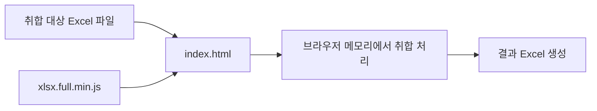

# 내부망용 오프라인 엑셀 취합 도구

공공기관·기업 내부망 PC에서 별도 서버나 프로그램 설치 없이 `index.html`을 실행하여 여러 Excel 파일을 취합하는 브라우저 기반 도구입니다.

- 인터넷 연결 불필요
- WAS / 웹서버 / DB 불필요
- Python / Node.js 설치 불필요
- Excel 원본 파일 수정 없음
- 결과 파일은 새 Excel 파일로 생성

---

## 주요 기능

### 1. 전체 취합
여러 Excel 파일의 **제목행은 한 번만 유지하고, 제목 아래의 데이터 행 전체를 하나의 목록으로 통합**합니다.

- 각 파일의 제목행을 기준으로 데이터 영역을 확인
- 제목 아래의 데이터 행을 순서대로 통합
- 빈 행은 제외
- 원본 파일명 표시 옵션 지원

예시:

```text
1팀.xlsx : 제목행 + A, B 데이터
2팀.xlsx : 제목행 + C, D 데이터
3팀.xlsx : 제목행 + E, F 데이터

→ 결과.xlsx : 제목행 + A, B, C, D, E, F 데이터
```

### 2. 취합양식에서 작성 부분만 취합
동일한 양식을 여러 부서에 배포한 뒤, 각 파일에서 **추가로 작성된 값과 행을 원래 양식의 해당 위치에 반영**합니다.

- 기준 항목을 이용해 동일한 위치 확인
- 기존 빈 셀에 작성된 값 반영
- 기존 값과 다른 값이 충돌하면 자동 덮어쓰기하지 않음
- 처리하지 못한 파일과 사유를 결과에 기록
- 추가된 행은 해당 위치에 반영
- 원본출처 표시 옵션 지원

---

## 사용 방법

```text
1. index.html을 더블 클릭하여 실행합니다.

2. 취합 방식을 선택합니다.
   - 전체 취합
   - 취합양식에서 작성 부분만 취합

3. [폴더 선택]에서 취합할 Excel 파일이 있는 폴더를 선택합니다.

4. 필요한 옵션을 선택합니다.

5. [취합 시작]을 클릭합니다.

6. 브라우저에서 생성된 결과 Excel 파일을 확인합니다.
```

임시 Excel 파일(`~$`로 시작하는 파일)과 지원하지 않는 파일은 취합 대상에서 제외합니다.

---

## 시스템 구성

별도의 백엔드 없이 사용자 PC의 브라우저에서 Excel 파일을 읽고 처리합니다.



### 처리 구조

```text
사용자 PC
   │
   ├─ index.html
   ├─ xlsx.full.min.js
   │
   └─ 사용자가 선택한 Excel 파일
             │
             ▼
       브라우저 메모리 처리
             │
             ▼
       취합 결과 Excel 생성
```

Excel 데이터 처리를 위해 외부 서버에 파일을 업로드하지 않습니다.

---

## 보안 및 내부망 사용

본 도구는 내부망 사용을 전제로 다음과 같이 구성합니다.

- 외부 API 호출 없음
- CDN 사용 없음
- 웹서버 / WAS 통신 없음
- DB 사용 없음
- Excel 내용의 서버 전송 없음
- 원본 Excel 파일 변경 없음
- 결과 파일은 사용자가 실행한 브라우저에서 생성

`xlsx.full.min.js`도 인터넷에서 불러오지 않고 프로젝트 폴더의 로컬 파일을 사용합니다.

---

## 프로젝트 구성

```text
ExcelAdd/
├── index.html
├── xlsx.full.min.js
├── README.md
├── LICENSE
└── docs/
    └── 시스템설계서_및_사용자매뉴얼.md
```

`README.txt`는 `README.md`와 내용이 중복되므로 별도로 유지하지 않아도 됩니다.

---

## 라이선스 및 오픈소스

### 본 프로젝트
프로젝트 자체의 라이선스는 저장소의 `LICENSE` 파일을 확인합니다.

### 사용 오픈소스
Excel 파일 읽기·쓰기를 위해 **SheetJS Community Edition (`xlsx.full.min.js`)**을 사용합니다.

배포 시 해당 라이브러리의 저작권 표시와 적용 라이선스 고지를 함께 유지합니다.

기관 내부의 오픈소스 사용 승인, 보안성 검토 또는 소프트웨어 반입 절차가 있는 경우 해당 내부 규정을 함께 따릅니다.

---

## 관리 원칙

- 사용 설명은 `README.md` 한 파일에서 관리합니다.
- 상세 시스템 설계와 사용자 매뉴얼은 `docs/시스템설계서_및_사용자매뉴얼.md`에서 관리합니다.
- 프로그램 수정 시 `README.md`의 기능 설명도 함께 갱신합니다.
- 외부 라이브러리를 추가할 경우 라이선스 정보를 함께 기록합니다.
